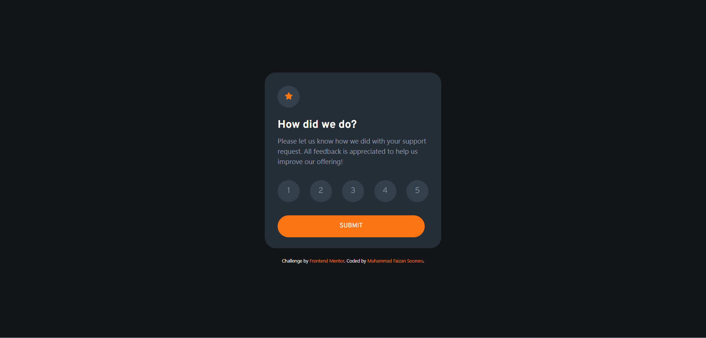
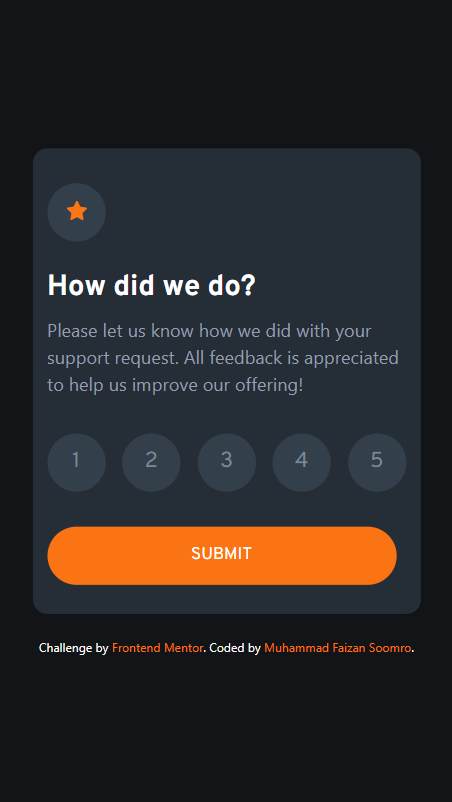

# Frontend Mentor - Interactive rating component solution

This is a solution to the [Interactive rating component challenge on Frontend Mentor](https://www.frontendmentor.io/challenges/interactive-rating-component-koxpeBUmI). 

## Table of contents

- [Overview](#overview)
  - [The challenge](#the-challenge)
  - [Screenshot](#screenshot)
  - [Links](#links)
- [My process](#my-process)
  - [Built with](#built-with)
  - [Continued development](#continued-development)
  - [Useful resources](#useful-resources)
- [Author](#author)

## Overview

### The challenge

Users should be able to:

- View the optimal layout for the app depending on their device's screen size
- See hover states for all interactive elements on the page
- Select and submit a number rating
- See the "Thank you" card state after submitting a rating

### Screenshot

## Desktop Sample

## Mobile Sample

### Links

- Solution URL: [Github Repository](https://github.com/Muhammad-Faizan-Soomro/rating-component)
- Live Site URL: [Website](https://muhammad-faizan-soomro.github.io/rating-component/)

## My process

### Built with

- Semantic HTML5 markup
- CSS custom properties
- Flexbox
- CSS Grid
- Mobile-first workflow
- [Tailwind CSS](https://tailwindcss.com/) - CSS Framework
- [jQuery](https://jquery.com/) - JS Library

### Continued development

I will use React to re-build this project.

### Useful resources

- [Tailwind CSS Docs](https://tailwindcss.com/docs/) - No need to go anywhere else for the syntax. These docs are amazing!
- [Flexbox Revision](https://css-tricks.com/snippets/css/a-guide-to-flexbox/) - Amazing website to revise Flexbox concepts.
- [Stack overflow](https://stackoverflow.com/) - To get help with jQuery syntax and concepts.
- [MDN Docs](https://developer.mozilla.org/en-US/docs/Web) - To revise various CSS concepts and get hold of their syntax.

## Author

- Github - [Muhammad Faizan Soomro](https://github.com/Muhammad-Faizan-Soomro/)
- Frontend Mentor - [@Muhammad-Faizan-Soomro](https://www.frontendmentor.io/profile/Muhammad-Faizan-Soomro)
- Twitter - [@faizannsoomro](https://www.twitter.com/faizannsoomro)
